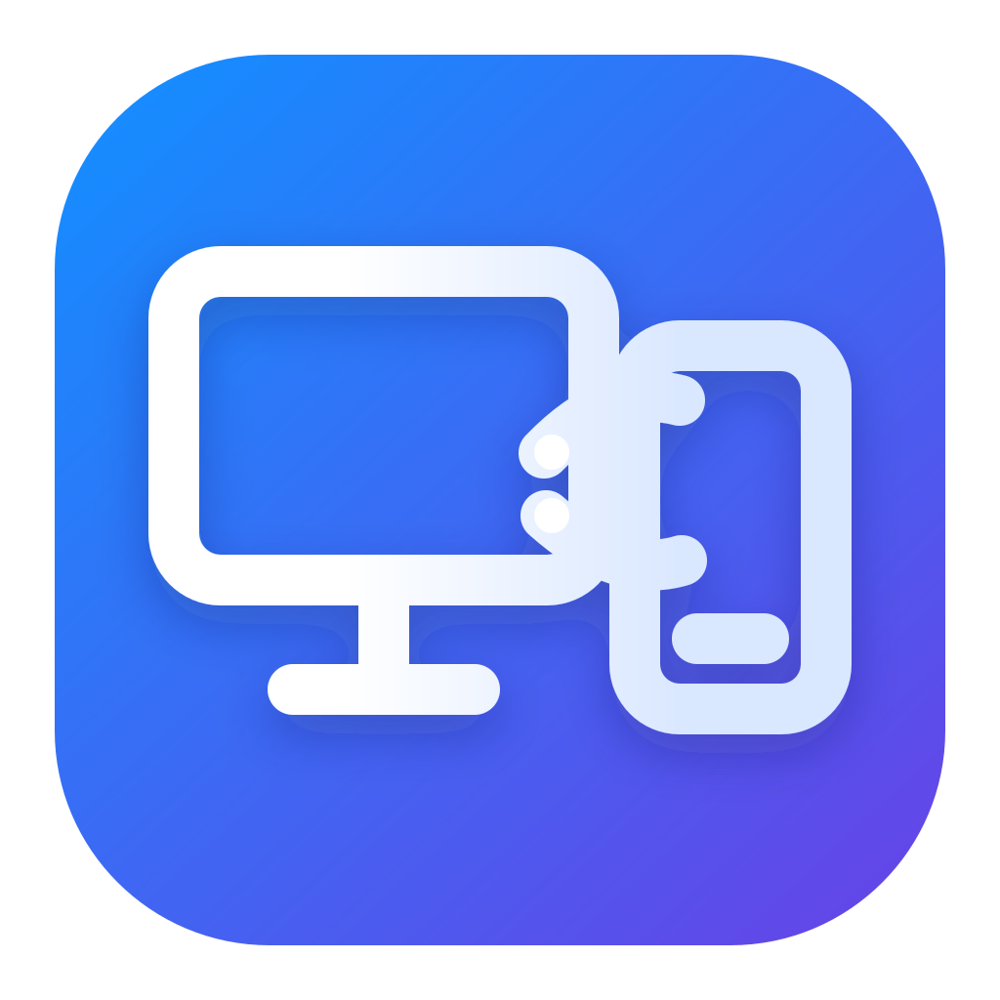
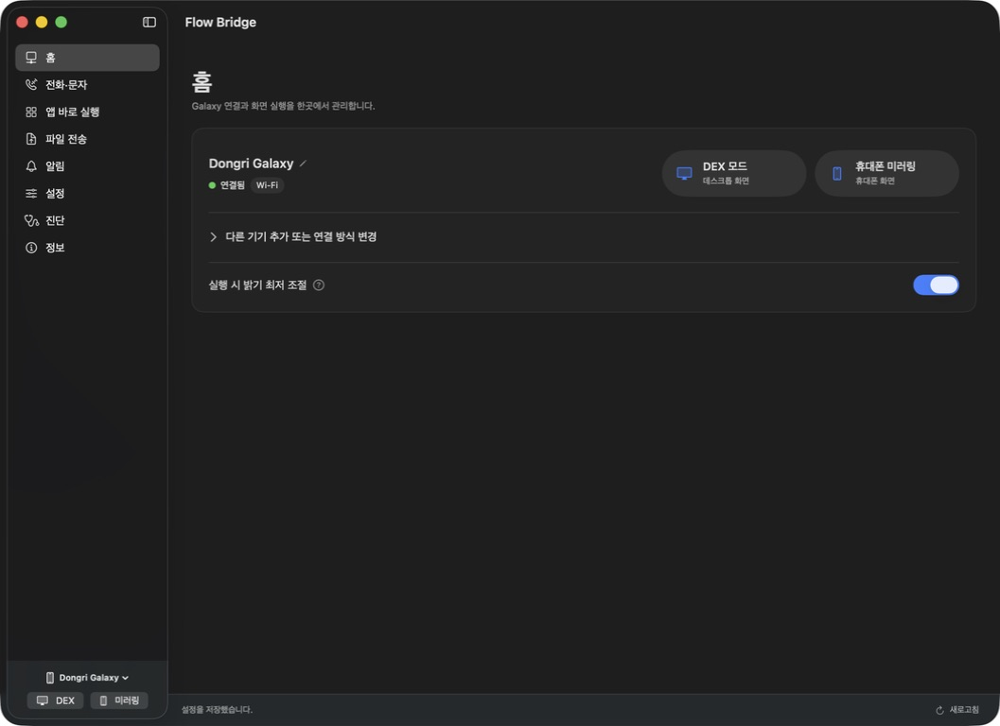

<p align="center">
  
</p>

<h1 align="center">Flow Bridge</h1>

<p align="center">
  Connect, mirror, and manage a Galaxy phone from macOS.<br>
  Galaxy 휴대폰을 macOS에서 연결하고 미러링하며 관리합니다.
</p>

<p align="center">
  
  
  
</p>



> This repository is under active development. The current release is ad-hoc
> signed and has not yet been notarized by Apple.

## English

Flow Bridge is a native SwiftUI utility for using a Samsung Galaxy phone from a
Mac over USB or wireless ADB. It bundles the required ADB and scrcpy runtimes for
both Apple silicon and Intel Macs, so users do not need Homebrew or a separate
runtime installation.

### Features

- Discover and remember USB, LAN, mDNS, and reachable Tailscale ADB connections
- Start a Samsung DeX virtual display or mirror the ordinary phone screen
- Optionally apply Galaxy Extra dim at maximum strength during mirroring while
  keeping the phone display powered, then restore the previous display state
- Launch Android apps in independent windows by friendly app name
- Open the Galaxy dialer and send SMS through the phone's default messaging app
- Browse live Galaxy contacts, recent calls, and SMS; only contact photos are cached locally for faster display
- Search installed apps, launch immediately, and assign Command-1/2/3 favorites
- Drop files anywhere in the app or press Command-V outside text editing to transfer Finder items
- Assign editable device aliases that remain stable when the transport or IP address changes
- Choose Dock, menu-bar-only, or Dock-only presence and whether the main window opens at launch
- Restore per-device Desktop Mode and phone-mirroring window geometry with compact floating controls
- Forward new call, message, and application notifications to Notification Center
- Transfer files and folders to the phone
- Copy and paste files with Command-C/Command-V, drag files and folders in both
  directions, and browse the Galaxy Download folder
- Save per-device display settings and per-app profiles
- Install and verify the official DX Companion recovery APK
- Korean and English interface, selected from the macOS language preference
- Universal macOS build for Apple silicon and Intel

### Requirements

- macOS 13 or later
- A Galaxy phone with USB debugging or wireless debugging enabled
- Samsung DeX support is required only for DeX mode; ordinary mirroring works
  without DeX mode

### Easy connection

1. Connect and authorize the phone over USB once.
2. Select the phone and click **Switch USB to Wireless**. Flow Bridge discovers
   the Wi-Fi address, enables ADB TCP mode, connects, remembers the endpoint, and
   reconnects automatically on later launches.
3. Without USB, open **Developer options → Wireless debugging → Pair device with
   pairing code** on the phone. Click **Find Pairing Screen** in Flow Bridge and
   enter only the six-digit code. The IP addresses and ports are discovered by
   mDNS and the connection endpoint is saved automatically.

Manual `IP:port` fields are kept under **Advanced Manual Connection** only for
networks that block mDNS, isolate Wi-Fi clients, or use a Tailscale address.

Call audio is not transported through ADB. Calls remain on the Galaxy phone or a
Bluetooth headset connected to it. SMS is sent only after the user presses the
send button in Flow Bridge; the app confirms the action through the default
Galaxy messaging UI without using fixed screen coordinates.

### Build

```sh
swift build
swift run DXManagerCoreTests
sh scripts/package-macos.sh
open "dist/Flow Bridge.app"
```

The packaged app and ZIP are written to `dist/`.

## 한국어

Flow Bridge는 USB 또는 무선 ADB를 통해 Galaxy 휴대폰을 Mac에서 사용하는
SwiftUI 기반 macOS 앱입니다. Apple Silicon과 Intel용 ADB·scrcpy 실행 환경을
앱에 포함하므로 Homebrew나 별도 런타임 설치가 필요하지 않습니다.

### 주요 기능

- USB·LAN·mDNS 및 접근 가능한 Tailscale ADB 연결 검색·기억·자동 재연결
- Samsung DeX 가상 화면 실행과 일반 휴대폰 화면 미러링
- 미러링 연결은 유지하면서 Galaxy 밝기 최저·더 어둡게(Extra dim)를 적용하고
  세션 종료 후 기존 화면 설정 복원
- 패키지명 대신 일반 앱 이름을 선택해 독립 창으로 실행
- Mac에서 Galaxy 주소록·최근 통화·문자를 확인하고 연락처 사진은 빠른 표시를 위해 로컬 캐시
- Mac에서 번호를 입력해 Galaxy 전화 화면을 열고 기본 메시지 앱을 통해 SMS 전송
- 전화·문자·애플리케이션 새 알림을 macOS 알림 센터로 전달
- Mac에서 Galaxy로 파일·폴더 전송
- `⌘C/⌘V` 파일 복사·붙여넣기, 양방향 드래그 앤 드롭과 Galaxy Download 폴더 탐색
- 기기별 화면 설정과 앱별 프로필 저장
- 공식 DX Companion 복구 APK 설치 및 무결성 검증
- macOS 언어 설정을 따르는 한국어·영어 인터페이스
- Apple Silicon·Intel 유니버설 빌드

문자는 사용자가 Flow Bridge의 전송 버튼을 누른 경우에만 Galaxy 기본 메시지 앱의
접근성 전송 버튼을 확인해 발송합니다. 고정 화면 좌표는 사용하지 않습니다.

### 간편 연결

1. 휴대폰을 USB로 한 번 연결하고 디버깅을 허용합니다.
2. Flow Bridge에서 기기를 선택하고 **USB에서 무선으로 전환**을 누릅니다. 휴대폰
   Wi-Fi 주소 확인, ADB TCP 전환, 연결과 주소 저장을 자동으로 처리합니다.
3. USB 없이 연결하려면 휴대폰의 **개발자 옵션 → 무선 디버깅 → 페어링 코드로
   기기 페어링**을 연 뒤 **페어링 화면 자동 검색**을 누르고 6자리 코드만 입력합니다.

`IP:포트` 직접 입력은 mDNS가 차단된 네트워크, Wi-Fi 클라이언트 격리 환경 또는
Tailscale 주소를 사용할 때만 고급·수동 연결에서 사용합니다.

## Privacy and security / 개인정보 및 보안

- No analytics, advertising SDK, cloud relay, or Flow Bridge account
- ADB commands always target the explicitly selected device serial
- Existing phone notifications are used as a baseline and are not replayed
- Notification contents are not persisted by Flow Bridge
- DX Companion is checked against its pinned SHA-256 before protected permission
  operations

Flow Bridge에는 분석·광고 SDK나 클라우드 중계, 별도 계정이 없습니다. ADB 명령은
선택된 기기 serial에만 전송되고 알림 내용은 Flow Bridge가 별도로 저장하지 않습니다.

## Attribution, licenses, and trademarks / 출처·라이선스·상표

Flow Bridge for macOS is based in part on
[DX Manager](https://github.com/maze-mei/DX-Manager) by maze-mei and uses its
source under the MIT License. The original copyright notice and license are
preserved in [`licenses/DX-MANAGER-MIT.txt`](licenses/DX-MANAGER-MIT.txt).

Flow Bridge also bundles or interoperates with scrcpy, Android Debug Bridge,
SDL, FFmpeg, and the official DX Companion. Those components remain under their
respective licenses. See
[`THIRD_PARTY_NOTICES.md`](DexManager/licenses/THIRD_PARTY_NOTICES.md).

Flow Bridge is an independent open-source project. It is not affiliated with,
sponsored by, endorsed by, or distributed by Samsung Electronics, Apple, Google,
Genymobile, or Microsoft. Samsung, Samsung Galaxy, Samsung Flow, and Samsung DeX
are trademarks of Samsung Electronics Co., Ltd. macOS is a trademark of Apple
Inc. Android is a trademark of Google LLC. Other names and marks belong to their
respective owners.

Flow Bridge macOS판은 maze-mei의
[DX Manager](https://github.com/maze-mei/DX-Manager)를 일부 기반으로 하며 MIT
License에 따라 사용·수정했습니다. 원저작권 표시와 라이선스 전문을 별도 파일로
보존합니다. Flow Bridge는 Samsung Electronics, Apple, Google, Genymobile 또는
Microsoft와 제휴·후원·보증 관계가 없는 독립 오픈소스 프로젝트입니다.

## License

Flow Bridge original macOS code is available under the MIT License. Copyright
© 2026 Lee Dong-Kyu (Dong-gri). Code inherited from DX Manager retains its
original copyright notice. Bundled third-party components retain their own
licenses.
